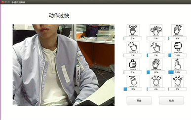

## Overview

This project uses front-end separation, and the client has the following three forms of implementation:

- Manual gesture recognition, which means that the user determines the segmentation of continuous gestures
- Dynamic gesture recognition based on frame difference method
- Dynamic gesture recognition based on object tracking

**Note**: No server code is currently provided.

## Dependencies

Python3.6, OpenCV3.4 + opencv_contrib

```
$ pip install opencv-python
$ pip install opencv-contrib-python
$ pip install pillow
$ pip install requests
```

## Usage

### Manual

<div align=center>

</div>

- server-address: gesture recognition server address

```
$ python run_manual.py -s [server-address]
```

Interactive mode: press the keyboard `s` key before each action, and press the `s` key again after the action is complete to complete the recognition

### Frame difference

you can choose the Background Subtraction Methods

- method: knn or mog
- threshold: The sum of the length and width of the contour identified by the algorithm is greater than the threshold is considered to be the hand

```
$ python run_frameDifferent -s [server-address] --method [method] --threshold [threshold]
```

### Object detection

<div align=center>

</div>

GPU support is required to run this version, we tested on Ubuntu 16.04 + cuda9.0 + cudnn7.0.5 +  tensorflow1.6. You need to install [tensorflow1.6-gpu](https://www.tensorflow.org/install/) extra and [darkflow](https://github.com/thtrieu/darkflow), You can download darkflow from [here](https://drive.google.com/open?id=1khaq-aWudYW_b4GC7R_tyzWiWL3AzJE9).

```
$ pip install tensorflow-gpu
$ pip install Cython
$ cd darkflow
$ pip install .

# Check whether the installation is complete
$ flow --h
```

and then download the [weight file](https://drive.google.com/open?id=1pcmIyYp1GcJOHNkzWPrPcg1tkMeCewTx) and [configuration file](https://drive.google.com/open?id=1nfp0LO-quY2LxiQ4zEQRdEVp6q6BzLG9), and place them in the `model` folder and `cfg` folder respectively. Finally, run

```
$ python run_objectDetection.py -s [server-address]
```